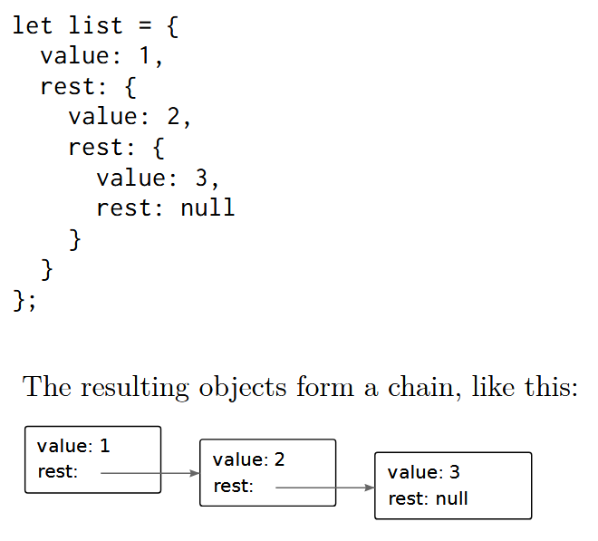

# Excercises from Eloquent Javascript

## 1 Looping a triangle

Write a loop that makes seven calls to
console.log
to output the following
triangle:

```
#
##
###
####
#####
######
#######
```

*Writing a loop would be boring so here is recursive solution:*

```js
const printTree = (char) => {
    console.log(char)
    const addedChar = char.concat(char.charAt(0))
    addedChar.length <= 7 ? h(newChar) : undefined
}
```

## 2 FizzBuzz

*The evergreen FizzBuzz*

```js

const fizzBuzzer = (number) => {
    if (number % 15 === 0) return "FizzBuzz"
    else if (number % 5 === 0) return "Buzz"
    else if (number % 3 === 0) return "Fizz" 
    else return number
}

Array(100).fill().map((_, i) => console.log(fizzBuzzer(i+1)))
```

## 3 Chessboard

Write a program that creates a string that represents an 8×8 grid, using newline
characters to separate lines. At each position of the grid there is either a space
or a "#" character. The characters should form a chessboard.
Passing this string to
console.log
should show something like this:
```
 # # # #
# # # #
 # # # #
# # # #
 # # # #
# # # #
 # # # #
# # # #
```
When you have a program that generates this pattern, define a binding size = 8 and change the program so that it works for any size , outputting a grid of the given width and height.

```js
const lineGenerator = (length, parity) => {
    return Array(length)
            .fill()
            .map((_, i) => i % 2 === parity ? ' ' : '#')
            .reduce((h, t) => h + t)
}

const boardPrinter = (size) => {
    return Array(size)
            .fill()
            .map((_, i) => lineGenerator(size, i % 2))
            .map(line => console.log(line))
}
```
### 4 Beancounting
You can get the Nth character, or letter, from a string by writing
"string"[N]. The returned value will be a string containing only one character (for example, "b"). The first character has position 0, which causes the last one to be found at position string.length - 1. In other words, a two-character string has length
2, and its characters have positions 0 and 1. Write a function countBs that takes a string as its only argument and returns a number that indicates how many uppercase “B” characters there are in the string. Next, write a function called countChar that behaves like countBs, except it takes a second argument that indicates the character that is to be counted (rather than counting only uppercase “B” characters). Rewrite
countBs to make use of this new function.

```js
const countChar = (string, charToCount, count = 0) => {
    const strLen = string.length
    const [h, t] = [string[0], string.substr(1, strLen)]
    if (strLen === 0) return count
    else return (h === charToCount ?
        countChar(t, charToCount, count+1) :
        countChar(t, charToCount, count))
}
```
### 5 The sum of a range
The introduction of this book alluded to the following as a nice way to compute
the sum of a range of numbers: console.log(sum(range(1, 10)));
Write a range function that takes two arguments, start and end, and returns an array containing all the numbers from start up to (and including) end. Next, write a sum function that takes an array of numbers and returns the sum of these numbers.  Run the example program and see whether it does
indeed return 55. As a bonus assignment, modify your range function to take an optional third argument that indicates the “step” value used when building the array. If no step is given, the elements go up by increments of one, corresponding to the old behavior. The function call range(1, 10, 2) should return [1, 3, 5, 7, 9]. Make sure it also works with negative step values so that range(5, 2, -1) produces [5, 4, 3, 2].

```js
const range = (start, end, step = 1) => {
    const rangeLength = Math.floor((Math.abs(end - start) + 1) / Math.abs(step))
    return Array(rangeLength).fill()
        .map((_, i) => start + step * i)
}

const sum = (array) => {
    return(array.reduce((h,t) => h+t))
}
```

### 6 Reversing an array
Arrays have a reverse method that changes the array by inverting the order in which its elements appear. For this exercise, write two functions, reverseArray and reverseArrayInPlace. The first,reverseArray, takes an array as argument and produces a new array that has the same elements in the inverse order. The second, reverseArrayInPlace, does what the reverse method does: it modifies the array given as argument by reversing its elements. Neither may use the standard reverse method.

```js
const reverseArray = (array) => {
    const arrLength = array.length
    if (arrLength <= 1) return [...array]
    else return [array[arrLength - 1], ...reverseArray(array.slice(1, arrLength - 1)), array[0]]
}
```

### 7 Array to List



Write a function arrayToList that builds up a list structure like the one shown when given
[1, 2, 3] as argument. Also write a listToArray function that produces an array from a list. Then add a helper function prepend, which takes an element and a list and creates a new list that adds the element to the front of the input list, and nth, which takes a list and a number and returns
the element at the given position in the list (with zero referring to the first element) or undefined when there is no such element.

```js
const arrayToList = (array) => {
    const listValue = array.length === 0 ? null : array[0] 
    const restValue = array.length <= 1 ? null : arrayToList(array.slice(1))
    return {value: listValue, rest: restValue}
}

const listToArray = (list) => {
    const head = [list["value"]] || [] 
    return list["rest"] ? head.concat(listToArray(list["rest"])) : head
}
```

### 8 Deep Comparison

Write a function deepEqual that takes two values and returns true only if they are the same value or are objects with the same properties, where the values of the properties are equal when compared with a recursive call to deepEqual.

```js
const isNull = e => e === null
const isObject = e => typeof(e) === 'object'
const isNullOrObject = e => isNull(e) || isObject(e)
const any = (arr) => arr.reduce((o, e) => o || e, false)]
```
*There are array methods some and every that provide functionality of any and all.*

```
const deepEqual = (e1, e2) => {
    if (typeof(e1) === typeof(e2) && !any([e1, e2].map(isNullOrObject))) return e1 === e2
    else if (typeof(e1) !== typeof(e2)) return false
    else if (e1 === null && e2 === null) return true
    else return Object.keys(e1).reduce((acc, el) => acc || deepEqual(e1[el], e2[el]), false)
}
```

### 9 Flattening

Use the reduce method in combination with the concat method to “flatten” an array of arrays into a single array that has all the elements of the original arrays.

```js
const flattenArray = (arr) => {
    return arr.reduce((res, el) =>
        Array.isArray(el) ? res.concat(flattenArray(el)) : res.concat(el), [])
}
```
### 10 Your Own Loop
Write a higher-order function loop that provides something like a for loop statement. It takes a value, a test function, an update function, and a body function. Each iteration, it first runs the test function on the current loop value and stops if that returns false. Then it calls the body function, giving it the current value. Finally, it calls the update function to create a new value and starts from the beginning.

```js
const myLoop = (val, test, update, f) => {
    if(test(val)) {
        f(val)
        myLoop(update(val), test, update, f)
    }
    else return undefined
}
```
### 11 Everything

Analogous to the some method, arrays also have an every method. This one returns true when the given function returns true for every element in the array. In a way, some is a version of the || operator that acts on arrays, and every is like the && operator. Implement every as a function that takes an array and a predicate function as parameters. 

```js
const every = (f, arr) => {
    return arr.reduce((acc, el) => f(el) && acc, true)
}
```
### 12 Vector Type
Write a class Vec that represents a vector in two-dimensional space. It takes x and y parameters (numbers), which it should save to properties of the same name.
Give the Vec prototype two methods, plus and minus , that take another vector as a parameter and return a new vector that has the sum or difference of the two vectors’ (this and the parameter) x and y values. 
Add a getter property length to the prototype that computes the length of the vector—that is, the distance of the point (x, y) from the origin (0, 0).

```js

class Vec {
    constructor(x, y) {
        this.x = x || 0
        this.y = y || 0
    }

    plus(vec) { return new Vec(this.x + vec.x, this.y + vec.y) }

    minus(vec) { return new Vec(this.x - vec.x, this.y - vec.y) }

    length() { return Math.sqrt(Math.pow(this.x, 2) + Math.pow(this.y, 2)) }
}
```
### 13 Retry

Say you have a function primitiveMultiply that in 20 percent of cases mul- tiplies two numbers and in the other 80 percent of cases raises an exception of type MultiplicatorUnitFailure . Write a function that wraps this clunky function and just keeps trying until a call succeeds, after which it returns the result.
Make sure you handle only the exceptions you are trying to handle.

```js
class MultiplicatorUnitFailure extends Error {}

const primitiveMultiply = (e1, e2) => {
    if (Math.random() < 0.2) {
        return e1 * e2
    }
    else {
        throw new MultiplicatorUnitFailure("Not enough NukaCola")
    }
}

const retry = (fun, errorToCheck) => (...args) => {
    try {
        return fun(...args)
    } catch(err) {
        if (err instanceof errorToCheck) {
            return retry(fun, errorToCheck)(...args)
        }
        else {
            throw err
        }
    }
}

const retryPrimitive = retry(primitiveMultiply, MultiplicatorUnitFailure)
```

### 14 Build a table
An HTML table is built with the following tag structure:
```
<table>
    <tr>
        <th>name</th>
        <th>height</th>
        <th>place</th>
    </tr>
    <tr>
        <td>Kilimanjaro</td>
        <td>5895</td>
        <td>Tanzania</td>
    </tr>
</table>
```
For each row , the <table> tag contains a <tr> tag. Inside of these <tr> tags, we can put cell elements: either heading cells (<th>) or regular cells (<td>).
Given a data set of mountains, an array of objects with name , height , and place properties, generate the DOM structure for a table that enumerates the objects. It should have one column per key and one row per object, plus a header row with <th> elements at the top, listing the column names. 
Write this so that the columns are automatically derived from the objects, by taking the property names of the first object in the data.
Add the resulting table to the element with an id attribute of "mountains" so that it becomes visible in the document.
Once you have this working, right-align cells that contain number values by setting their style.textAlign property to "right".

```js
const mountainData = [{name: 'Kilimanjaro', height: 5895, place: 'Tanzania'}, {name: 'Kilimanjaroo', height: 5896, place: 'Tanzaniaa'}]

const generateTable = arr => {
    const columnNames = Object.keys(arr[0])
    const table = document.createElement('table')
    const headerRow = table.insertRow()

    columnNames.forEach(el => {
        const cell = document.createElement('th')
        cell.textContent = el
        headerRow.appendChild(cell)
    })

    arr.forEach(row => {
        const tableRow = table.insertRow()
        Object.values(row).forEach(cellData => {
            const cell = tableRow.insertCell()
            cell.textContent = cellData
        })
    })

    return table
}
```

### 15 Elements by tag name

The `document.getElementsByTagName` method returns all child elements with a given tag name. Implement your own version of this as a function that takes a node and a string (the tag name) as arguments and returns an array containing all descendant element nodes with the given tag name. To find the tag name of an element, use its `nodeName` property. But note that this will return the tag name in all uppercase. Use the toLowerCase or toUpperCase string methods to compensate for this.

```js
const getByTag = (node, tag) => {
    const results = []
    const upperTag = tag.toUpperCase()
    const drillDown = (node, tag) => {
        node.childNodes.forEach(child => {
            child.nodeName === tag ? results.push(child) : drillDown(child, tag)
        })
    }
    drillDown(node, upperTag)
    return results
}
```

